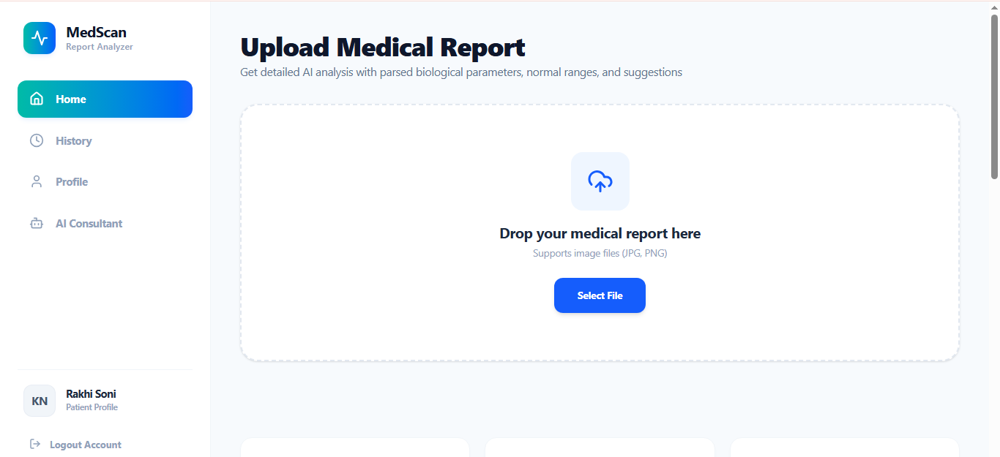
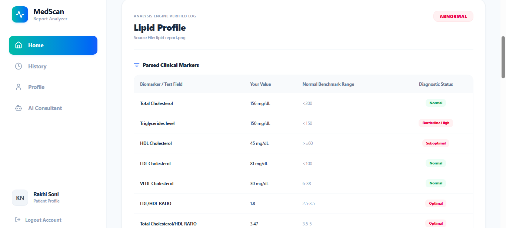
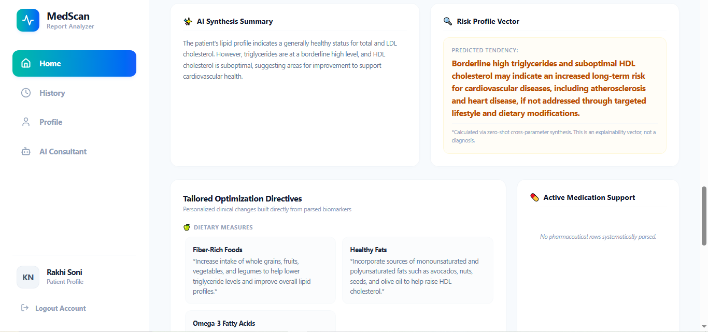
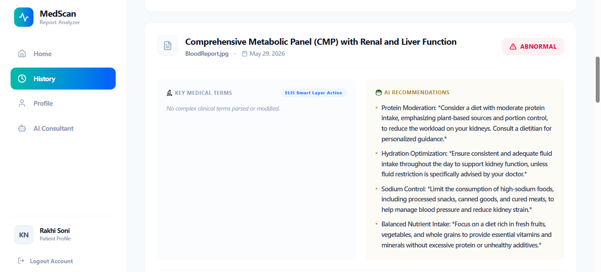
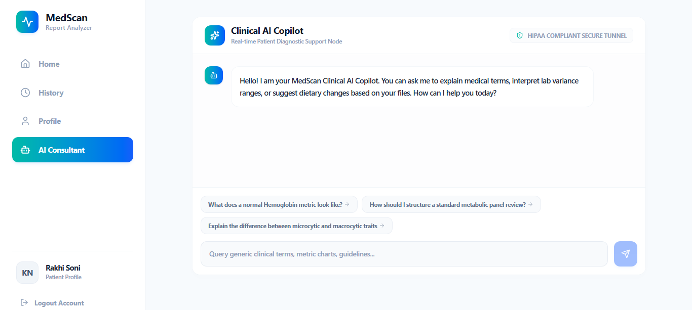

# 🩺 MedScan — AI-Powered Medical Report Analyzer

<div align="center">

### Transform Complex Medical Reports into Actionable Health Insights

AI-powered healthcare intelligence platform built using **MERN Stack** and **Google Gemini Vision API**


</div>

---

## 📖 Overview

MedScan is a full-stack healthcare intelligence platform that automates the analysis of medical reports using **Generative AI**. Users can upload pathology reports, extract clinical biomarkers, identify abnormalities, receive AI-generated summaries, and monitor health trends through an interactive dashboard.

Unlike traditional OCR systems, MedScan utilizes **Google Gemini Vision API** to understand the structure and context of medical reports, enabling accurate extraction of medical parameters and intelligent recommendations.

---

## ✨ Key Features

### 🔍 AI Medical Report Analysis

* Upload JPG and PNG medical reports
* Automatic biomarker extraction
* Detection of abnormal clinical values
* Intelligent parsing of laboratory reports

### 📊 Smart Clinical Insights

* AI-generated medical summaries
* Risk profile analysis
* Health trend monitoring
* Explainable AI recommendations

### 🥗 Personalized Recommendations

* Dietary suggestions
* Lifestyle optimization guidance
* Hydration recommendations
* Preventive healthcare insights

### 📈 Historical Tracking

* Complete report archive
* Biomarker trend visualization
* Long-term health monitoring
* Profile-based report management

### 🤖 AI Clinical Copilot

* Interactive healthcare chatbot
* Medical terminology explanations
* Personalized report discussions
* Clinical knowledge assistance

---

# 🏗️ System Architecture

```text
User
 │
 ▼
React Frontend
 │
 ▼
Node.js + Express Backend
 │
 ├── Google Gemini Vision API
 │
 └── MongoDB Atlas Database
        │
        ▼
 Report Storage + Analysis History
```

---

# 🖼️ Application Screenshots

## 🏠 Home Page

Upload medical reports and start AI-powered analysis instantly.



---

## 📋 Clinical Report Analysis

Extracted biomarkers with diagnostic status, benchmark ranges, and severity indicators.



---

## 🧠 AI Synthesis Summary

Automatically generated medical interpretation and health risk assessment.



---

## 📜 Report History

Access and manage all previously analyzed reports.



---

## 🤖 AI Clinical Copilot

Conversational healthcare assistant for understanding reports and medical terminology.



---

# 🚀 Technology Stack

## Frontend

* React.js
* Tailwind CSS
* React Router
* Axios
* Recharts

## Backend

* Node.js
* Express.js
* Multer
* JWT Authentication
* REST APIs

## Database

* MongoDB Atlas
* Mongoose ODM

## Artificial Intelligence

* Google Gemini Vision API
* Prompt Engineering
* Medical Report Parsing

## Development Tools

* VS Code
* Git & GitHub
* Postman
* MongoDB Compass

---

# ⚙️ Installation

## Clone Repository

```bash
git clone https://github.com/yourusername/medscan.git

cd medscan
```

---

## Backend Setup

```bash
cd backend

npm install
```

Create `.env`

```env
PORT=5000

MONGO_URI=your_mongodb_connection_string

GEMINI_API_KEY=your_gemini_api_key

JWT_SECRET=your_secret_key
```

Run Backend

```bash
npm start
```

---

## Frontend Setup

```bash
cd frontend

npm install

npm start
```

Application will run on:

```text
Frontend:
http://localhost:3000

Backend:
http://localhost:5000
```


---

# 🔄 Workflow

### Step 1

User uploads a medical report.

### Step 2

Backend forwards image to Gemini Vision API.

### Step 3

AI extracts biomarkers and reference ranges.

### Step 4

System identifies abnormalities.

### Step 5

AI generates:

* Summary
* Risk Profile
* Dietary Recommendations

### Step 6

Data is stored in MongoDB Atlas.

### Step 7

Dashboard and history are updated.

---

# 📈 Future Enhancements

* PDF report support
* Wearable device integration
* Multi-language medical reports
* Doctor collaboration portal
* Appointment scheduling
* Advanced health analytics
* Predictive disease risk modeling

---

# 🔒 Security Features

* JWT Authentication
* Environment Variable Protection
* Secure API Communication
* Input Validation
* Protected Routes
* MongoDB Atlas Security Controls

---

# 🎯 Use Cases

* Patients
* Healthcare Clinics
* Diagnostic Laboratories
* Medical Students
* Health Monitoring Applications


---

### "Making Healthcare Reports Understandable Through AI"
